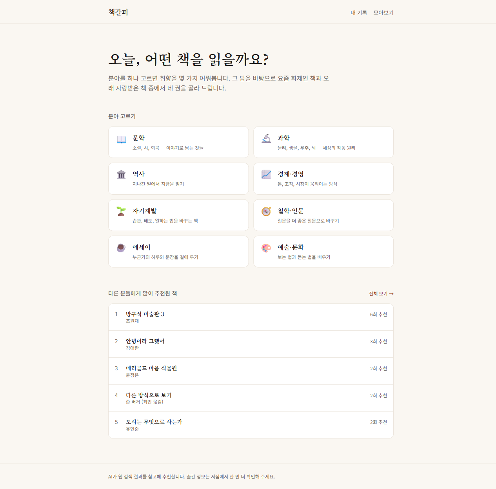
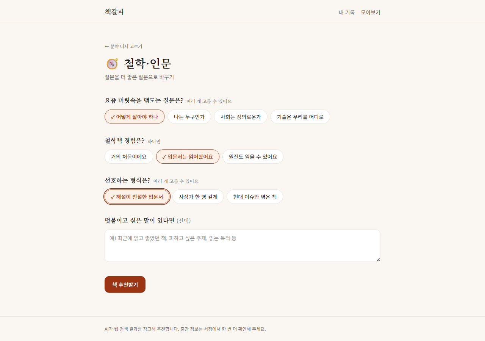
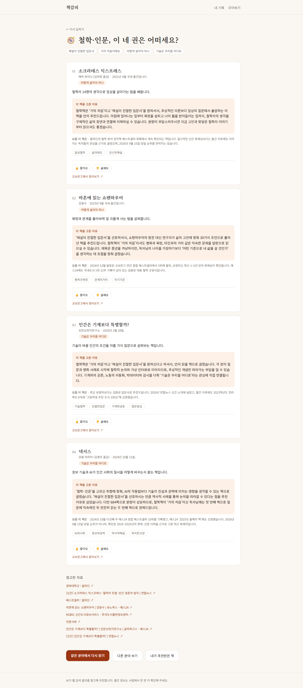
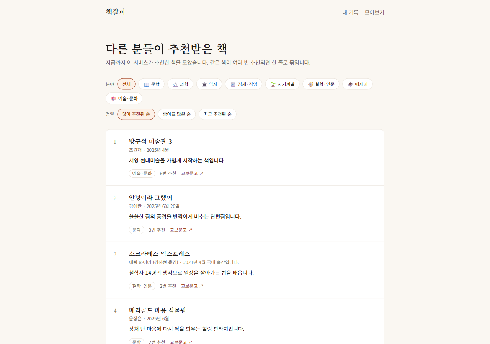

# 책갈피 — 분야별 AI 책 추천

분야를 고르고 취향 질문에 답하면, AI가 **웹 검색으로 요즘 화제인 책까지 확인해서** 네 권을 골라 줍니다.
로그인은 없습니다. 추천 세션은 익명 UUID로만 구분됩니다.

<p align="center">
  
</p>

<p align="center">
  <sub>원본 화질 <a href="docs/intro-9x16.mp4">MP4 (1080x1920, 20초)</a> · Remotion 소스는 <a href="video/"><code>video/</code></a></sub>
</p>

## 화면


**홈 `/` — 분야 고르기 + 많이 추천된 책**



**취향 질문 `/genre/[slug]` — DB에 저장된 질문을 그대로 렌더링**



**추천 결과 `/result/[id]` — 책 4권 + 고른 이유 + 참고 자료**



**모아보기 `/books` — 지금까지 추천된 책 전체 (분야 필터·정렬)**



## 스택

| 역할 | 선택 |
|---|---|
| 프레임워크 | Next.js 16 (App Router) + Tailwind v4 |
| 데이터베이스 | Neon Postgres (Vercel Marketplace 연동) |
| AI | OpenAI + AI SDK v7 (`generateText` + `Output.object` + `web_search` 툴) |

## 흐름

```
/                    분야 8개 + 많이 추천된 책 랭킹      ← genres, recommendations, feedback
/genre/[slug]        취향 질문 (DB에 저장된 질문 렌더링)  ← genres.questions
POST /api/recommend  주제별 병렬 웹 검색 → 책 4권 → 저장  → sessions, recommendations
/result/[id]         추천 결과 + 참고 자료 + 좋아요        ← recommendations
/books               추천된 책 전체 (분야 필터·정렬)      ← recommendations, sessions, feedback
/my                  내가 추천받은 기록 (이 브라우저)      ← localStorage + POST /api/sessions
POST /api/feedback   👍/👎 저장                         → feedback
POST /api/sessions   세션 id 목록 → 그 세션들의 추천 반환  ← sessions, recommendations
```

## 주제별 병렬 호출

첫 질문(세부 관심 주제)은 복수 선택이 가능하다. 4권을 한 번에 맡기면 모델이 특정 주제로
쏠려서 고른 주제 하나가 통째로 빠지는 일이 반복됐다 (예: 미술+영화+건축을 골랐는데
건축 대신 고르지도 않은 음악 책이 들어옴). 프롬프트 강화로는 재발을 막지 못해,
`recommendBooks` 가 **주제마다 따로 호출**하고 결과를 합치도록 바꿨다. 3주제면 2+1+1권.
커버리지가 프롬프트가 아니라 코드로 보장되고, 병렬이라 소요 시간은 그대로다.

## 테이블

- `genres` — 분야와 분야별 취향 질문(jsonb). `db/genres.ts` 에서 시딩.
  질문마다 `multi` 플래그가 있어 복수 선택 여부가 갈린다.
- `sessions` — 익명 추천 세션. 고른 분야, 답변(jsonb), 자유 입력, 생성 시각.
- `recommendations` — AI가 고른 책. 세션당 4행. 제목·저자·출간시점·한줄평·추천 이유·
  화제성·태그·주제·참고 출처.
- `feedback` — 추천별 👍/👎. 홈과 `/books` 랭킹 집계에 쓰인다.

**저장하지 않는 것**: 이름, 이메일, 비밀번호, IP, User-Agent, 쿠키. 로그인이 없고
사용자를 식별하는 컬럼 자체가 없다. 세션은 익명 UUID로만 구분된다.

## 내 추천 기록 (`/my`)

로그인이 없으므로 "누가 이 세션을 만들었는지"는 서버가 알지 못한다.
대신 추천이 성공하면 세션 UUID를 그 브라우저의 `localStorage` 에 쌓아두고(`lib/history.ts`,
최대 50개), `/my` 가 그 목록을 `POST /api/sessions` 로 보내 내용을 받아온다.
따라서 기록은 **기기·브라우저마다 따로**이며, 브라우저 데이터를 지우면 함께 사라진다.
시크릿 모드처럼 저장소 접근이 막힌 환경에서도 추천 자체는 정상 동작한다.

## 시작하기

```bash
npm install
vercel env pull          # DATABASE_URL 등을 .env.local 로 받아온다
# .env.local 에 OPENAI_API_KEY=sk-... 추가
npm run db:init          # 스키마 생성 + 분야 시딩 (여러 번 실행해도 안전)
npm run dev
```

## 환경변수

| 이름 | 필수 | 설명 |
|---|---|---|
| `DATABASE_URL` | ✅ | Neon 연동 시 자동 주입 |
| `OPENAI_API_KEY` | ✅ | https://platform.openai.com/api-keys |
| `OPENAI_MODEL` | — | 기본값 `gpt-5.5` |

## 분야나 질문을 고치려면

`db/genres.ts` 를 수정하고 `npm run db:init` 을 다시 실행하면 됩니다 (slug 기준 upsert).

## 배포

```bash
vercel env add OPENAI_API_KEY production
vercel deploy --prod
```

Neon은 이미 프로젝트에 연결돼 있어 `DATABASE_URL` 은 배포 환경에 자동으로 들어갑니다.
첫 배포 전에 로컬에서 `npm run db:init` 을 한 번 실행해 두면 운영 DB에도 스키마가 적용됩니다
(같은 Neon 인스턴스를 씁니다).

## 알아둘 점

- 추천 1회에 웹 검색이 들어가 **1~2분** 걸립니다 (실측 약 2분). 함수 타임아웃은 300초로 잡아두었습니다.
- AI가 책 정보를 틀릴 수 있어, 각 카드에 교보문고 검색 링크와 참고 자료 출처를 함께 보여줍니다.
